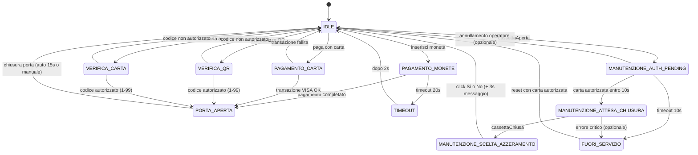

# Data Model: Svuotamento Cassetta Monete con Autenticazione

**Feature**: 003-aggiungere-operazione-svuotamento
**Data**: 2025-10-17
**Versione**: 1.0

## Overview

Questo documento definisce il modello dati per la feature di svuotamento cassetta monete con autenticazione operatore. Include nuove entità, modifiche a componenti esistenti e schema stato FSM esteso.

---

## Entità Principali

### 1. SensoreCassetta

Simula sensore hardware di apertura/chiusura cassetta monete.

**Attributi**:
| Campo | Tipo | Descrizione | Valori Permessi | Default |
|-------|------|-------------|-----------------|---------|
| `stato` | `string` | Stato corrente cassetta | `'aperta'` \| `'chiusa'` | `'chiusa'` |
| `listeners` | `Object` | Event listeners registrati | `{ cassettaAperta: Function[], cassettaChiusa: Function[] }` | `{ cassettaAperta: [], cassettaChiusa: [] }` |

**Metodi**:
- `apri(): void` - Apre cassetta, emette evento `cassettaAperta`
- `chiudi(): void` - Chiude cassetta, emette evento `cassettaChiusa`
- `on(evento: string, callback: Function): void` - Registra listener per evento
- `notifica(evento: string): void` - Notifica tutti listener di evento
- `getStato(): string` - Ritorna stato corrente (`'aperta'` | `'chiusa'`)

**Validazioni**:
- `apri()`: Se `stato === 'aperta'`, log warning e return (idempotente)
- `chiudi()`: Se `stato === 'chiusa'`, log warning e return (idempotente)

**Eventi Emessi**:
- `cassettaAperta`: Emesso quando cassetta passa da chiusa → aperta
- `cassettaChiusa`: Emesso quando cassetta passa da aperta → chiusa

**Relazioni**:
- Collegato a `Chiosco` tramite listener eventi
- Controllato da UI admin (pulsanti "Apri Cassetta" / "Chiudi Cassetta")

---

### 2. Suoneria

Gestisce allarme sonoro per stato FUORI_SERVIZIO.

**Attributi**:
| Campo | Tipo | Descrizione | Valori Permessi | Default |
|-------|------|-------------|-----------------|---------|
| `audioContext` | `AudioContext` | Context Web Audio API | Instance AudioContext | `new AudioContext()` |
| `oscillator` | `OscillatorNode \| null` | Oscillatore per beep | OscillatorNode o null | `null` |
| `gainNode` | `GainNode \| null` | Controllo volume | GainNode o null | `null` |
| `attiva` | `boolean` | Suoneria attualmente attiva | `true` \| `false` | `false` |

**Metodi**:
- `attiva(): void` - Attiva suoneria continua (beep 800Hz, volume 30%)
- `disattiva(): void` - Disattiva suoneria e rilascia risorse
- `isAttiva(): boolean` - Ritorna se suoneria è attualmente attiva

**Parametri Audio**:
- Frequenza: 800 Hz (beep acuto ma non fastidioso)
- Volume: 30% (0.3 gain) - regolabile da DevTools
- Forma d'onda: `sine` (onda sinusoidale pura)
- Loop: Continuo fino a disattivazione manuale

**Validazioni**:
- `attiva()`: Se già `attiva === true`, return early (idempotente)
- `disattiva()`: Se già `attiva === false`, return early (idempotente)

**Relazioni**:
- Controllata da `Chiosco` (attivata in `onEntraFuoriServizio()`, disattivata in reset)
- Override test: `window.suoneriaEnabled = false` disabilita completamente

---

### 3. GestoreManutenzione

Coordina operazioni di manutenzione cassetta (countdown, logging, tracking).

**Attributi**:
| Campo | Tipo | Descrizione | Valori Permessi | Default |
|-------|------|-------------|-----------------|---------|
| `chiosco` | `Chiosco` | Riferimento a Chiosco FSM | Instance Chiosco | Passato in constructor |
| `timerCountdown` | `number \| null` | ID timer countdown 10s | setInterval ID o null | `null` |
| `secondiRimanenti` | `number` | Secondi rimasti countdown | 0-10 | `10` |
| `operazioneCorrente` | `OperazioneSvuotamento \| null` | Operazione in corso | Instance o null | `null` |

**Metodi**:
- `avviaCountdown(callback: Function): void` - Avvia countdown 10s, chiama callback a timeout
- `fermaCountdown(): void` - Ferma countdown e pulisce timer
- `aggiornaDisplay(): void` - Aggiorna display con secondi rimanenti
- `iniziaOperazione(): OperazioneSvuotamento` - Crea nuova operazione e logga apertura
- `completaOperazione(azzerato: boolean, saldoPrima: number, saldoDopo: number): void` - Finalizza operazione e logga

**Validazioni**:
- `avviaCountdown()`: Ferma countdown precedente se presente
- `secondiRimanenti`: Clampato a 0 (non può andare negativo)

**Relazioni**:
- Collegato a `Chiosco` (riceve riferimento in constructor)
- Crea e gestisce `OperazioneSvuotamento`
- Aggiorna `Display` per countdown visivo

---

### 4. OperazioneSvuotamento

Entità di processo che traccia singola operazione di svuotamento cassetta.

**Attributi**:
| Campo | Tipo | Descrizione | Valori Permessi | Default |
|-------|------|-------------|-----------------|---------|
| `timestampApertura` | `string \| null` | Timestamp ISO 8601 apertura cassetta | ISO 8601 string o null | `null` |
| `timestampAutenticazione` | `string \| null` | Timestamp autenticazione operatore | ISO 8601 string o null | `null` |
| `codiceOperatore` | `string \| null` | Codice carta operatore autorizzato | Stringa numerica (1-99) o null | `null` |
| `timestampChiusura` | `string \| null` | Timestamp chiusura cassetta | ISO 8601 string o null | `null` |
| `saldoPrima` | `number \| null` | Saldo gettoniera prima azzeramento | Float >= 0 o null | `null` |
| `saldoDopo` | `number \| null` | Saldo gettoniera dopo azzeramento | Float >= 0 o null | `null` |
| `azzerato` | `boolean \| null` | Operatore ha scelto azzeramento | `true` \| `false` \| null | `null` |

**Metodi**:
- `logEvento(tipo: string, dettagli: Object): void` - Logga evento manutenzione con timestamp

**Eventi Loggati**:
| Tipo | Livello Log | Dettagli | Quando |
|------|-------------|----------|--------|
| `APERTURA` | INFO | timestamp | Cassetta aperta |
| `AUTH_SUCCESS` | INFO | timestamp, codice | Autenticazione valida |
| `AUTH_FAIL` | WARN | timestamp, codice | Autenticazione fallita |
| `TIMEOUT` | ERROR | timestamp | Countdown raggiunge 0 |
| `CHIUSURA` | INFO | timestamp | Cassetta chiusa |
| `AZZERAMENTO` | INFO | timestamp, azzerato, saldoPrima, saldoDopo | Scelta azzeramento |
| `FUORI_SERVIZIO` | ERROR | timestamp | Entrata in FUORI_SERVIZIO |
| `RESET` | INFO | timestamp, codice | Reset da FUORI_SERVIZIO |

**Validazioni**:
- Timestamp: Formato ISO 8601 (`new Date().toISOString()`)
- `codiceOperatore`: Deve essere validato da `Validatore.isCodiceAutorizzato()` prima di assegnazione
- `saldoPrima`, `saldoDopo`: Validati da `Gettoniera.validaSaldo()` (>= 0, non NaN)

**Relazioni**:
- Creata e gestita da `GestoreManutenzione`
- Dati loggati su console browser (non persistiti)

---

## Modifiche a Componenti Esistenti

### Chiosco (FSM)

**Nuovi Stati Aggiunti**:
```javascript
'MANUTENZIONE_AUTH_PENDING': {
  permessi: ['MANUTENZIONE_ATTESA_CHIUSURA', 'FUORI_SERVIZIO', 'IDLE']
},
'MANUTENZIONE_ATTESA_CHIUSURA': {
  permessi: ['MANUTENZIONE_SCELTA_AZZERAMENTO', 'FUORI_SERVIZIO']
},
'MANUTENZIONE_SCELTA_AZZERAMENTO': {
  permessi: ['IDLE']
},
'FUORI_SERVIZIO': {
  permessi: ['IDLE'] // Solo tramite reset autorizzato
}
```

**Nuovi Attributi**:
| Campo | Tipo | Descrizione | Default |
|-------|------|-------------|---------|
| `gestoreManutenzione` | `GestoreManutenzione` | Gestore operazioni manutenzione | `new GestoreManutenzione(this)` |
| `sensoreCassetta` | `SensoreCassetta` | Sensore apertura/chiusura cassetta | `new SensoreCassetta()` |
| `suoneria` | `Suoneria` | Allarme FUORI_SERVIZIO | `new Suoneria()` |

**Nuovi Handler Stati**:
- `onEntraManutenzioneAuthPending()` - Avvia countdown 10s, mostra messaggio autenticazione
- `onEntraManutenzioneAttesaChiusura()` - Ferma countdown, mostra "Attesa chiusura cassetta"
- `onEntraManutenzioneSceltaAzzeramento()` - Mostra pulsanti Sì/No con saldo corrente
- `onEntraFuoriServizio()` - Attiva suoneria, disabilita input clienti
- `onEsceFuoriServizio()` - Disattiva suoneria (chiamato quando transita a IDLE)

**Modifiche Metodi Esistenti**:
- `abilitaInput(abilita)`: Forza `inputAbilitato = false` se stato in `['MANUTENZIONE_AUTH_PENDING', 'MANUTENZIONE_ATTESA_CHIUSURA', 'MANUTENZIONE_SCELTA_AZZERAMENTO', 'FUORI_SERVIZIO']`
- `reset()`: Aggiunge chiamata `this.suoneria.disattiva()` e `this.gestoreManutenzione.fermaCountdown()`

**Transizioni Speciali**:
```javascript
// US5: Apertura cassetta durante transito
if (evento === 'cassettaAperta' && ['PORTA_APERTA', 'PAGAMENTO_MONETE', 'PAGAMENTO_CARTA'].includes(this.stato)) {
  this.pendenteAperturaCassetta = true; // Flag per transizione dopo ritorno a IDLE
  return;
}

// Reset da FUORI_SERVIZIO
if (stato === 'FUORI_SERVIZIO' && evento === 'cartaAutorizzata') {
  this.transizione('IDLE');
  this.suoneria.disattiva();
}
```

---

### Gettoniera

**Nuovi Metodi**:
```javascript
validaSaldo(): number {
  let saldo = this.importoTotale - this.importoInserito;
  if (isNaN(saldo) || saldo < 0) {
    log.warn(`Gettoniera: saldo anomalo rilevato (${saldo}), resettato a 0.00€`);
    saldo = 0.00;
  }
  return saldo;
}

azzeraSaldo(): number {
  const saldoPrecedente = this.validaSaldo();
  this.importoInserito = 0;
  this.importoTotale = 1.20; // Reset a costo accesso standard
  log.info(`Gettoniera: saldo azzerato (da ${saldoPrecedente.toFixed(2)}€ a 0.00€)`);
  return saldoPrecedente;
}
```

**Modifiche Attributi**:
- Nessuna modifica a attributi esistenti
- `importoInserito` e `importoTotale` usati per calcolo saldo

---

### Display

**Nuovi Metodi**:
```javascript
mostraFuoriServizio(): void {
  // Mostra "⚠️ FUORI SERVIZIO - Chiamare assistenza" con stile rosso
  this.elemento.classList.add('fuori-servizio');
  this.mostraMessaggio('⚠️ FUORI SERVIZIO', 'error', 'Chiamare assistenza');
}

aggiornaCountdown(secondi: number): void {
  // Aggiorna countdown visivo con numero grande + colore rosso se < 3s
  const countdownEl = document.getElementById('countdown-timer');
  countdownEl.textContent = `${secondi} secondi rimasti`;
  if (secondi <= 3) {
    countdownEl.classList.add('urgente');
  }
}

mostraPulsantiAzzeramento(saldo: number): void {
  // Mostra pulsanti "Sì" / "No" con saldo corrente
  const msgSaldo = `Azzerare saldo monete (${saldo.toFixed(2)}€)?`;
  this.mostraMessaggio(msgSaldo, 'info');
  // Attiva pulsanti Sì/No (già presenti in HTML, nascosti di default)
  document.getElementById('btn-azzera-si').disabled = false;
  document.getElementById('btn-azzera-no').disabled = false;
}
```

**Modifiche CSS**:
- `.display.fuori-servizio`: Sfondo rosso/arancione, testo grande, icona ⚠️
- `.display.manutenzione`: Sfondo giallo, testo "Manutenzione in corso"
- `.countdown-timer`: Font size 3rem, colore rosso quando `.urgente`
- `.btn-azzeramento`: Pulsanti grandi (min 80x40px)

---

### Validatore

**Nessuna Modifica**: La feature riusa metodo esistente `isCodiceAutorizzato(codice: string): boolean` per validare carte operatori (stessa lista clienti autorizzati: numeri 1-99).

---

## Schema FSM Completo



**Stati Totali**: 11 (7 esistenti + 4 nuovi manutenzione)

**Caratteristiche Stati Manutenzione**:
- `MANUTENZIONE_AUTH_PENDING`: Input cliente disabilitati, countdown 10s attivo
- `MANUTENZIONE_ATTESA_CHIUSURA`: Input cliente disabilitati, countdown fermato
- `MANUTENZIONE_SCELTA_AZZERAMENTO`: Input cliente disabilitati, pulsanti Sì/No attivi
- `FUORI_SERVIZIO`: TUTTI input disabilitati tranne reset autorizzato, suoneria attiva

---

## Validazioni e Invarianti

### Invarianti FSM
1. **Single State**: Chiosco è sempre in esattamente 1 stato
2. **Input Lock**: Durante stati manutenzione, `inputAbilitato === false`
3. **Suoneria**: Attiva SE E SOLO SE `stato === 'FUORI_SERVIZIO'`
4. **Countdown**: Attivo SE E SOLO SE `stato === 'MANUTENZIONE_AUTH_PENDING'`

### Validazioni Dati
1. **Codici autorizzati**: `1 <= parseInt(codice) <= 99`
2. **Saldo gettoniera**: `saldo >= 0 && !isNaN(saldo)`
3. **Timestamp**: Formato ISO 8601 valido
4. **Stato cassetta**: `'aperta' | 'chiusa'` (no altri valori)

### Regole Business
1. **Autenticazione**: Solo codici 1-99 autorizzati (riuso validazione esistente)
2. **Timeout**: 10 secondi esatti (± 200ms per NFR-001)
3. **Azzeramento**: Saldo validato prima di mostrare pulsanti
4. **Reset FUORI_SERVIZIO**: Solo con carta autorizzata (no auto-reset)

---

## Diagramma Entità-Relazioni

```
┌─────────────────┐
│     Chiosco     │
│    (FSM Core)   │
└────────┬────────┘
         │ has
         ├──────────────────────────┬─────────────────────┐
         │                          │                     │
         ▼                          ▼                     ▼
┌─────────────────┐        ┌──────────────────┐  ┌──────────────┐
│ GestoreManutenzione│      │  SensoreCassetta │  │   Suoneria   │
│   - timerCountdown│      │   - stato        │  │  - attiva    │
│   - operazioneCorrente│  │   - listeners    │  │  - oscillator│
└────────┬────────┘        └──────────────────┘  └──────────────┘
         │ creates                                        │
         │                                                │ controls
         ▼                                                ▼
┌──────────────────────┐                         (Web Audio API)
│ OperazioneSvuotamento│
│  - timestampApertura │
│  - codiceOperatore   │
│  - saldoPrima/Dopo   │
└──────────────────────┘

        ┌─────────────┐        ┌──────────────┐
        │  Gettoniera │        │   Display    │
        │  [MODIFIED] │        │  [MODIFIED]  │
        │ +azzeraSaldo│        │ +mostraFuoriServizio│
        └─────────────┘        └──────────────┘

        ┌──────────────┐
        │  Validatore  │
        │ [UNCHANGED]  │
        │ isCodiceAutorizzato│
        └──────────────┘
```

**Legenda**:
- `has`: Composizione (componente contiene istanza)
- `creates`: Factory (componente crea istanze su richiesta)
- `controls`: Controllo diretto (chiamate metodi)
- `[MODIFIED]`: Componente esistente con nuovi metodi
- `[UNCHANGED]`: Componente esistente senza modifiche

---

## Performance & Scalability

### Limiti di Scala
- **Operazioni simultanee**: 1 operazione manutenzione alla volta (atomica)
- **Log console**: Illimitati ma non persistiti (solo in memoria browser session)
- **Countdown precision**: ±200ms accettabile (setInterval 1000ms)

### Resource Usage
- **Memory**: ~50KB per `OperazioneSvuotamento` (trascurabile)
- **CPU**: ~1% per suoneria Web Audio API
- **Network**: 0 (tutto client-side)

### Bottlenecks Potenziali
- **Nessuno identificato**: Feature completamente client-side, no I/O, no elaborazioni pesanti

---

## Security Considerations

### Autenticazione
- **Codici hardcoded**: Numeri 1-99 in `Validatore` (non configurabili)
- **No brute-force protection**: Operatore può tentare infiniti codici (mitigato da timeout 10s)
- **Logging**: Codici operatore loggati in chiaro su console (accettabile per MVP)

### Stato Sensibile
- **Saldo non persistito**: Reset a 0 su reload pagina (comportamento sicuro)
- **No remote reset**: Solo reset locale con carta fisica (previene attacchi remoti)

### Audit Trail
- **Log console**: Tutte operazioni manutenzione tracciate con timestamp
- **No export**: Log non esportabili (feature futura se richiesta)

---

**Versione**: 1.0 | **Stato**: ✅ Completo
**Prossimo step**: Generare `contracts/` (API schemas se applicabili)
